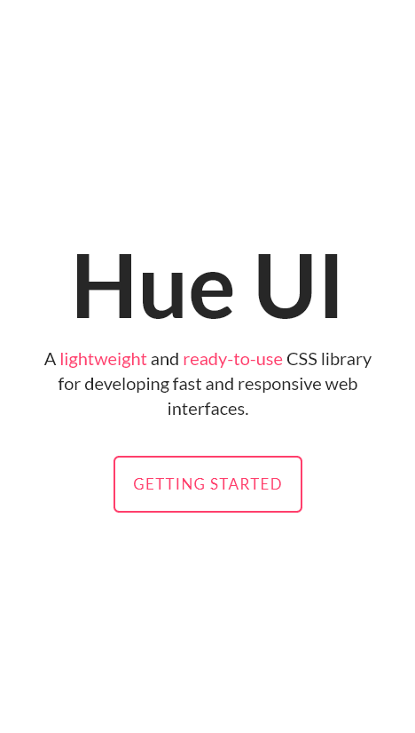
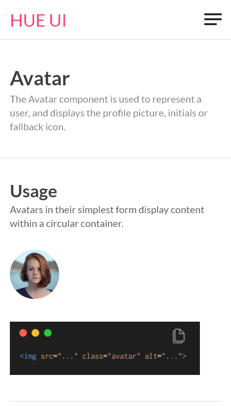

# [Hue UI - A CSS Component Library](https://hue-ui.vercel.app/)

A lightweight and ready-to-use CSS library for developing fast and responsive web interfaces! 😀

<br />

## **Table of contents**

- [Overview](#overview)

  - [Usage](#usage)
  - [Documentation](#documentation)
  - [Screenshot](#screenshot)

- [My process](#my-process)
  - [Built with](#built-with)
  - [What I learned](#what-i-learned)
  - [Continued development](#continued-development)
  - [Useful resources](#useful-resources)
- [Author](#author)
- [Acknowledgments](#acknowledgments)

<br />

## **Overview**

<br />

### **Usage**

<br />

### **CSS**

Just copy-paste the stylesheet `<link>` into your `<head>` to load our CSS.

```html
<link rel="stylesheet" href="https://hue-ui.vercel.app/css/main.css" />
```

<br />

### **JS**

Some of our components require the use of JavaScript to function. Place our script at the end of your page content, right before the closing `<body>` tag, to enable them.

```html
<script src="https://hue-ui.vercel.app/js/main.js"></script>
```

<br />

### **Documentation**

Check out our **[documentation website](https://hue-ui.vercel.app/getting-started.html)**.

<br /><br />

### **Screenshot**

 <br /><br />
<br /><br />
<br /><br />


<br />

## **My process**

### **Built with**

- Semantic HTML5 markup
- CSS3
- SCSS
- Flexbox
- Mobile-first workflow
- Vanilla JS

<br />

### **What I learned**

This was my first time using **SCSS** in a big project, so I learned a lot! 😀
Besides the learning, I realized how important it is to stay organized and write code that is **clean** and **reusable**, especially as the project grows larger.

<br />

One of the things that I loved about **SCSS** is how easy it is to nest elements.

<br />

```css
nav ul {
  margin: 0;
  padding: 0;
  list-style: none;
}
nav li {
  display: inline-block;
}
nav a {
  display: block;
  padding: 6px 12px;
  text-decoration: none;
}
```

<br />

The above **CSS** code can be written in **SCSS** as below:<br /><br />

```scss
nav {
  ul {
    margin: 0;
    padding: 0;
    list-style: none;
  }

  li {
    display: inline-block;
  }

  a {
    display: block;
    padding: 6px 12px;
    text-decoration: none;
  }
}
```

<br />

### **Continued development**

- Structured code in a better way
- Learn more about **functions** and **mixins** in SCSS

### **Useful resources**

- **[SCSS](https://sass-lang.com/)** - This helped me greatly in learning **SCSS** and its variety of features. I really liked the examples given in **SCSS** documentation which helped me a lot to transition from writing **CSS** to **SCSS**.
- **[Flexbox](https://css-tricks.com/snippets/css/a-guide-to-flexbox/)** - This is an amazing article on **flexbox** which helped me understand how flex works. I'd recommend it to anyone still learning this concept.

## **Author**

- **Website** - [Pranshu Dobhal](https://pranshudobhal.netlify.app/)
- **Twitter** - [@pranshu_dobhal](https://twitter.com/pranshu_dobhal)
- **LinkedIn** - [pranshudobhal](https://www.linkedin.com/in/pranshudobhal/)

## **Acknowledgments**

A big thanks to my mentor **[Tanay Pratap](https://twitter.com/tanaypratap)** for inspiring me and making me break my limits and also to my fellow **[NeoGrammers](https://twitter.com/neogcamp)** who supported and helped me throughout.😀
